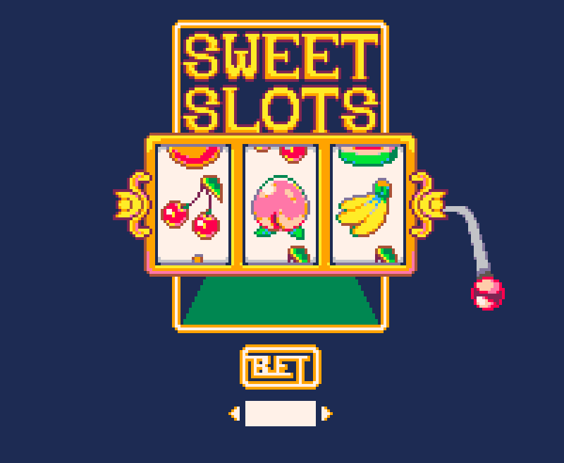

# 🍑🍒Fruit Slots🍎🍊

## What is Fruit Slots?
Legend has it that the first slot machine originated in 1894's San Francisco. An early version of the slot machine displayed fruits on the reels, each representing a different flavour of gum that would be dispensed by the win, giving rise to the name "Fruit machine". 

Although most machines are fully digital nowadays, many still include skeuomorphic elements such as a lever handle to pull or spinning slot visuals. Slot machines are the most popular way to gamble in the United States, despite having the lowest odds of any casino game. Perhaps this is due to its perceived simplicity as a game of luck rather than skill. To play, one must:
1. Select a bet amount
2. Pull the lever
3. If 3-of-a-kind line up horizontally, the player wins!
 
## Wireframe & Visuals:

**UI/Theme:** Cute/vibrant pixel art in a darkened room

**Colour palette:** [Pico-8](https://lospec.com/palette-list/pico-8)

**Font:** [VT323](https://fonts.google.com/specimen/VT323)

## Technologies used: 
- HTML 
- CSS 
- JavaScript 
- Aseprite (art)
- FamiTracker (music)

## User Stories:
As a user...
- I want to be able to see slot machine visuals
- I want to be able to change my bet because slots are a gambling game
- I want to be able to "pull" the handle because that is how slots are played
- I want the machine to "randomly" display 3 pictures of fruit after the handle is pulled 
- I want to be able to win if I get 3 matching items in a row
- I want to be able to lose money if I don't get 3 matching items in a row
- I want there to be different payouts depending on what items matched
- I want to know what the different payouts are
- I want my cursor to change showing what parts of the machine are interactable
- I want to see text come up if I win, lose, or lose all my money and can no longer play

## Getting Started:
Open the game in a browser
1. Select a bet amount with the up and down buttons (min 10)
2. Click the lever
3. If 3-of-a-kind line up horizontally, you win!

## Planned Future Enhancements
- I want to win with a single cherry or a single peach in slot 1 or double cherry in slots 1 and 2
- I want to use a button to increase or decrease bet rather than preset bet amounts
- I want to hear sound effects when the wheel spins
- I want background music so I feel like I'm in a real casino
- I want different slot machines with different minimum bet amounts and different odds
- I want to see a "spinning" animation 
- I want the handle to move down when I click it and move up when I let go
- I want there to be a delay between each image appearing e.g., "1.png... 2.png ... 3.png" 

## Pseudocode
**** denotes planned features

1) Define required constants  
    1.1) Create an allFruits object including all 6 images, the odds/payout for each, and their names. e.g., name = cherry, odds = 5, img = cherry.png   
    1.2) Create an array representing each spinning wheel with lower-payout elements appearing more often e.g., [cherry, cherry, cherry, cherry, cherry, apple, apple, apple, apple, melon, melon, melon, orange, orange, banana, peach]  

2) Define required variables used to track the state of the game  
    2.1) Player's starting money is 200  
    2.2) Player's starting bet is 10  
    2.3) Winning status is false  
    2.4) An array of 3 variables representing the 3 reels  

3) Cache DOM elements  
    3.1) Cache bet selector button  
    3.2) Cache the play "button"  
    3.3) Cache the messaging area  
    3.4) Cache the money display  
    3.5) Cache the bet display  

4) Upon loading the app should:  
    4.1) Initialize the money, bet & spun reel variables  
    4.2) Render those values to the page   
    4.3) Wait for the user to interact  

5) Handle player making a bet  
    5.1) function betting() checks if a player is increaseing or decreasing a bet  
    5.2) adds or decreases by 10  
    5.3) betting() also checks if a player has enough money to increase the bet to that amount  
    5.4) calls render() to make changes in DOM  

6) Handle a player clicking the handle  
    6.1) function spinning() - when the player clicks the handle, it runs the spin() function 3 times  
    6.2) running spin() on each array element gives an array of 3 different "fruit"  
    6.3) checks for a winner with the function isWinning()  
    6.4) adjusts the player's current money payOut() based on the results of isWinning()  
    6.5) runs the render() function to display results  

7) Handle generating random spins  
    7.1) spin() gets a random number based on the length of the fruit array  
    7.2) spin() changes the value of the array based on what the index of the random number corresponds to in the fruit array  

8) Handle winning  
    8.1) function isWinning() determines whether the player wins if 3 fruits match or if the player loses  
    8.2) returns true or false based on result  

9) Handle payout  
    9.1) ff isWinning() returns true, multiply bet by the odds of corresponding allFruits element and add to playerMoney  
    9.2) if isWinning() returns false, bet is subtracted from playerMoney  

10) Rendering changes in DOM  
    10.1) updates machine handle when handle is clicked  
    10.2) updates current bet increase/decrease  
    10.3) updates images on the fruit machine  
    10.4) updates current amount of money  
    10.5) updates text to declare a winner/loser 
    ****) a second of delay between each slot reveal  
    ****) spinning animation plays between spins  
    ****) handle moves down when clicked and goes up when let go of  
